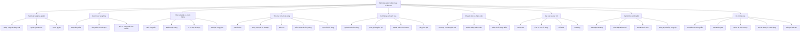

# Lược đồ phân rã chức năng

```mermaid
flowchart TB
    SYS[Hệ thống quản lý bán hàng và tồn kho]

    SYS --> AUTH[Tài khoản và phân quyền]
    SYS --> CAT[Danh mục hàng hóa]
    SYS --> REC[Nhà cung cấp và nhận hàng]
    SYS --> INV[Tồn kho và hạn sử dụng]
    SYS --> SAL[Bán hàng và thanh toán]
    SYS --> PRO[Khuyến mãi và thành viên]
    SYS --> REP[Báo cáo và truy vết]
    SYS --> DEV[Đa thiết bị và đồng bộ]
    SYS --> TRN[Hỗ trợ đào tạo]

    AUTH --> AUTH1[Đăng nhập và đăng xuất]
    AUTH --> AUTH2[Quản lý tài khoản]
    AUTH --> AUTH3[Phân quyền]

    CAT --> CAT1[Loại sản phẩm]
    CAT --> CAT2[Sản phẩm và mã vạch]
    CAT --> CAT3[Giá và trạng thái kinh doanh]

    REC --> REC1[Nhà cung cấp]
    REC --> REC2[Phiếu nhận hàng]
    REC --> REC3[Lô và hạn sử dụng]
    REC --> REC4[Sai lệch hàng giao]

    INV --> INV1[Tra cứu tồn]
    INV --> INV2[Hàng cận hạn và hết hạn]
    INV --> INV3[Kiểm kê]
    INV --> INV4[Điều chỉnh và xử lý hàng]
    INV --> INV5[Lịch sử biến động]

    SAL --> SAL1[Quét và tra cứu hàng]
    SAL --> SAL2[Tính giá và giảm giá]
    SAL --> SAL3[Thanh toán và hóa đơn]
    SAL --> SAL4[Hủy giao dịch]

    PRO --> PRO1[Chương trình khuyến mãi]
    PRO --> PRO2[Khách hàng thành viên]
    PRO --> PRO3[Tích và sử dụng điểm]

    REP --> REP1[Doanh thu]
    REP --> REP2[Tồn và hạn sử dụng]
    REP --> REP3[Kiểm kê]
    REP --> REP4[Audit log]

    DEV --> DEV1[Giao diện desktop]
    DEV --> DEV2[Giao diện điện thoại]
    DEV --> DEV3[Lưu thao tác chờ]
    DEV --> DEV4[Đồng bộ và xử lý xung đột]

    TRN --> TRN1[Kịch bản và hướng dẫn]
    TRN --> TRN2[Môi trường 2D]
    TRN --> TRN3[Phiên dữ liệu cách ly]
    TRN --> TRN4[Ghi và đánh giá hành động]
    TRN --> TRN5[Kết quả đào tạo]
```

Màu sắc và mức ưu tiên chưa được thể hiện trên lược đồ. Phần P1/P2/P3 được quản lý trong tài liệu danh sách yêu cầu.

