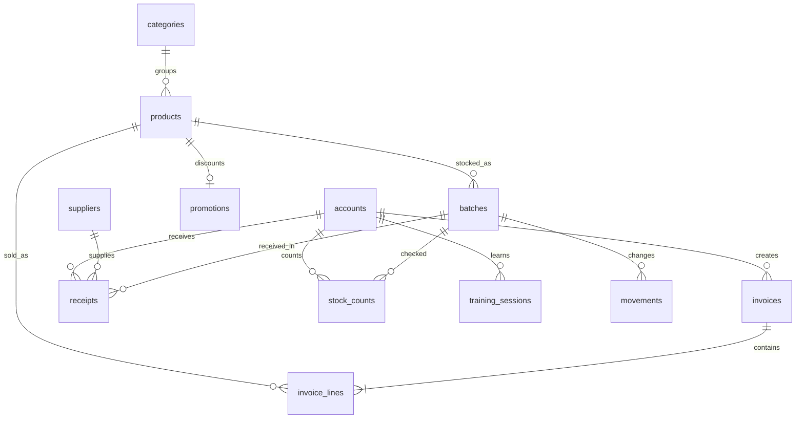

# Mô hình dữ liệu và API — Sprint 1

Schema vật lý chuẩn nằm trong `services/api/src/main/resources/db/migration`. Hibernate chỉ validate, không tự tạo/sửa bảng. Tất cả thời điểm giao dịch là `timestamptz`; ngày hết hạn là `date`, ngày nghiệp vụ tính theo Asia/Ho_Chi_Minh. Giá/tiền là số nguyên đồng Việt Nam, không dùng float lưu tiền.

## Data dictionary

Mọi bảng có `id varchar(255)` làm PK. ID nghiệp vụ mới là prefix + UUID; tài khoản mẫu dùng NV001/KHO001/QL001/KT001/ADMIN001. Khóa ngoại chặn xóa dữ liệu đang được tham chiếu. Danh mục dùng soft deactivate để giữ lịch sử. V3 thêm hai role và điều kiện orientation; giữ nguyên V1/V2 đã áp dụng.

| Bảng | Trường chính / ràng buộc |
|---|---|
| accounts | name; role ∈ admin/accountant/manager/sales/stock; password BCrypt; active. Không serialize entity này ra API |
| categories | name unique; active. products.category tham chiếu name; chưa cho đổi/ngừng khi còn sản phẩm tham chiếu |
| products | name; barcode unique 8–14 chữ số; category FK; unit; price bigint >0; emoji; active |
| suppliers | name; phone; active |
| batches | product_id FK; quantity integer ≥0; expiry; version bigint @Version. Index (product_id,expiry,id) phục vụ FEFO |
| receipts | supplier/product/batch_id FK; accepted >0; rejected ≥0; note tối đa 500; actor FK; at |
| invoices | at; actor FK; staff snapshot; method; total >0; tendered ≥total; change_due=tendered-total |
| invoice_lines | invoice_id/product_id FK; name snapshot; quantity >0; price đã giảm >0; original_price ≥price |
| movements | product_id/batch_id FK; quantity có dấu; kind; reference (ID chứng từ nguồn); actor FK; at |
| promotions | product_id FK unique; percent 1–90; end_date. Một ưu đãi theo sản phẩm tại một thời điểm |
| stock_counts | product_id/batch_id FK; expected/actual ≥0; base_version; status REVIEW/CONFLICT/APPROVED; note; actor; at |
| operations | actor FK; request_body/response_body text; PK gồm actor và idempotency key. Retry cùng payload trả kết quả đã ghi; khác payload bị chặn |
| store_lock | Một dòng STORE01; khóa bi quan cấp cửa hàng, serialize thay đổi tồn/danh mục trong phạm vi một doanh nghiệp mẫu |
| training_sessions | actor FK; chapter=0; status ACTIVE/COMPLETED; visited danh sách 6 mã điểm; orientation_passed; started_at/completed_at. Không FK tới tồn kho, hóa đơn hoặc chứng từ |

`visited` là tập nhỏ cố định trong Chapter 0, chưa phải schema đánh giá mọi loại chapter. Khi phát triển chương nghiệp vụ, chuyển sang bảng training_events/objectives riêng; không nhét giao dịch đào tạo vào bảng vận hành.

## Quy tắc transaction

- Nhận hàng: kiểm dữ liệu → tạo lô → phiếu nhận → movement tăng; cùng transaction. Không tự sửa lô có mã trùng.
- Bán: server kiểm active/quantity, tính khuyến mãi, chọn lô còn hạn theo expiry/id → hóa đơn/chi tiết → giảm lô/movement. Không dùng giá từ client; toàn bộ rollback nếu thiếu tồn/tiền hoặc lỗi DB.
- Mã thao tác của nhận/bán/kiểm kê chống retry do mất phản hồi. Single-store lock là lựa chọn đơn giản có chủ ý, **không** tuyên bố chịu tải đa tenant/đa chi nhánh.
- Kiểm kê: không đổi tồn khi gửi phiếu. Nếu version/expected không khớp → CONFLICT. Quản lý duyệt REVIEW với version còn đúng mới điều chỉnh; duyệt lại bị chặn.
- Đào tạo: kiểm quyền sở hữu session, whitelist station; complete chỉ khi đủ 6 station và orientation_passed (3 đáp án đúng). V3 bảo toàn các phiên đã COMPLETED từ phiên bản trước. Đây không phải hệ thống chống gian lận game; server không xác thực tọa độ vật lý.

## REST contract

Tất cả URL dưới `/api`, JSON UTF-8 ngoại trừ login là form-urlencoded. CSRF header cần cho mọi request thay đổi. Không CORS cross-origin mặc định; PWA/Godot export chạy cùng origin qua reverse proxy.

| Method / path | Input / kết quả | Quyền |
|---|---|---|
| GET /health | status UP + database | Public |
| GET /csrf | token + headerName, cookie session | Public |
| POST /auth/login | username,password; xoay session ID, trả ok | Public + CSRF |
| POST /auth/logout | invalidate session, 204 | CSRF |
| GET /me | id,name,role; không password | Đã đăng nhập |
| GET /state | read model lọc role; sales chỉ hóa đơn của mình, stock không hóa đơn, accountant không danh mục/lô/phiếu kho | Cả 5 role |
| GET /products?query=, /categories | tìm tên/barcode hoặc danh mục | admin/manager/sales/stock |
| GET /suppliers | danh sách | admin/manager/stock |
| POST /products, /categories, /suppliers | tạo, trả entity không chứa secret | admin/manager |
| PUT /{products,categories,suppliers}/{id} | sửa thông tin | admin/manager |
| DELETE /{products,categories,suppliers}/{id} | ngừng sử dụng, không xóa lịch sử | admin/manager |
| POST /invoices | lines[{id,quantity}],method,tendered; trả id,total,changeDue | sales/admin + Idempotency-Key |
| POST /receipts | supplier,product,lot,expiry,delivered,accepted,note | stock/admin + Idempotency-Key |
| POST /counts | batchId,expected,actual,baseVersion,note | manager/admin + Idempotency-Key |
| POST /counts/{id}/approve | trả status | admin/manager |
| POST /promotions | productId,percent,end | admin/manager |
| GET /training/sessions | lịch sử của mình | Đã đăng nhập |
| POST /training/sessions | chapter:0, trả session mới | Đã đăng nhập |
| POST /training/sessions/{id}/events | station: mentor/checkout/shelves/chilled/receiving/carts | Chủ phiên |
| POST /training/sessions/{id}/orientation | welcome=checkout, sensitive=manager, delivery=receiving; chỉ nhận sau đủ 6 điểm | Chủ phiên |
| POST /training/sessions/{id}/complete | chỉ hoàn thành khi đủ 6 điểm và orientation_passed | Chủ phiên |

Lỗi có `{message}`; 400 dữ liệu sai định dạng, 401 chưa đăng nhập, 403 không quyền/CSRF, 404 không tìm thấy hoặc phiên đào tạo người khác, 409 xung đột nghiệp vụ/trùng dữ liệu/chương chưa mở. UI hiển thị lỗi, không ghi state lạc quan trước server xác nhận.

Godot Web gửi event qua `postMessage` cho PWA; PWA kiểm exact origin, iframe source, station whitelist rồi gọi **cùng API bằng session hiện hành**. Không đưa mật khẩu/token qua URL iframe. Đây là bridge vận chuyển API cho Web export, Godot vẫn sở hữu toàn bộ map, physics, nhân vật và hội thoại.

## Chưa thuộc bản này

Chưa có tenant/org/subscription, quản lý tài khoản/khôi phục mật khẩu, payment gateway, camera scan, đánh giá kỹ năng của Chapter 1–6, bán hàng offline, backup/restore tự động và kiểm thử tải. Chưa kiểm nghiệm trên máy yếu nhất của nhóm. Trước internet production cần harden secrets, HTTPS, rate limit đăng nhập, lifecycle tài khoản, retention/idempotency cleanup, phân trang read model, backup/restore và giám sát.
